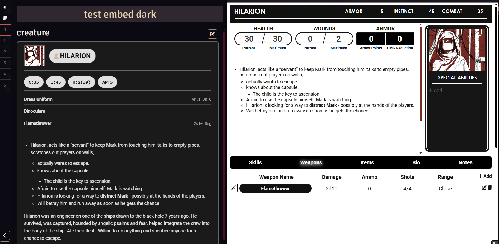
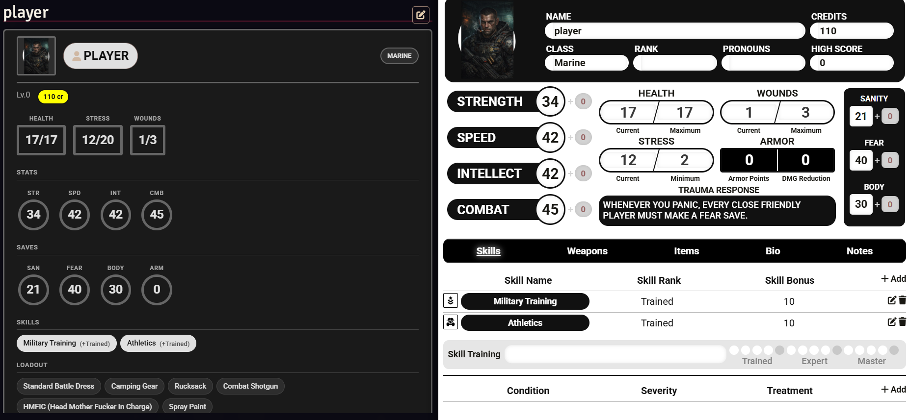
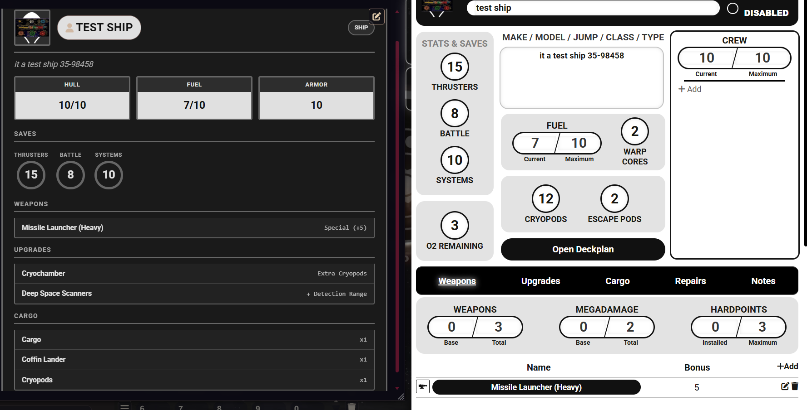
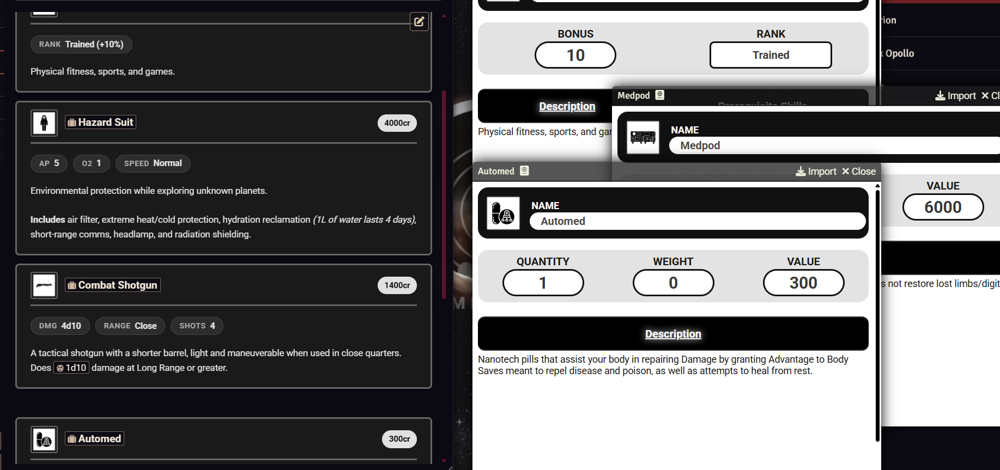
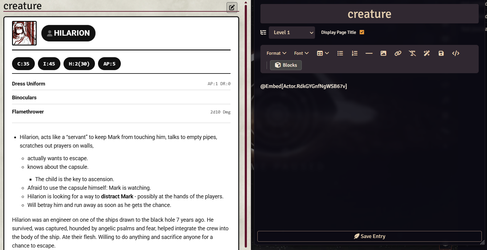
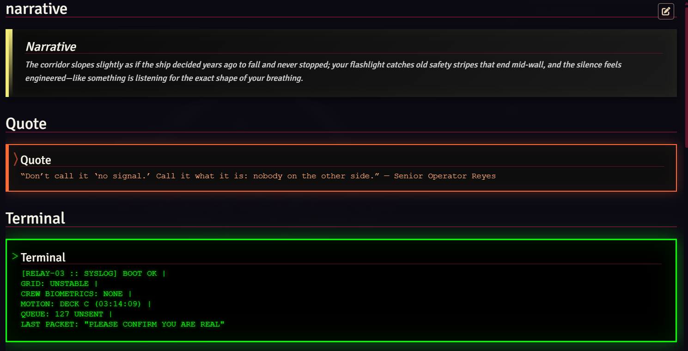
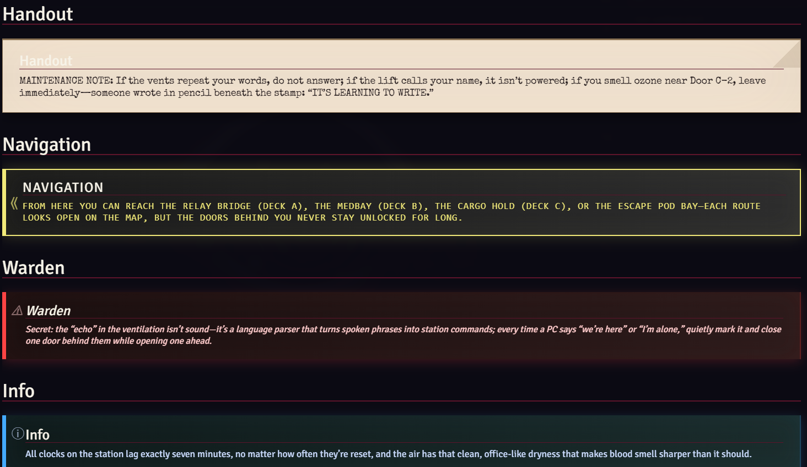
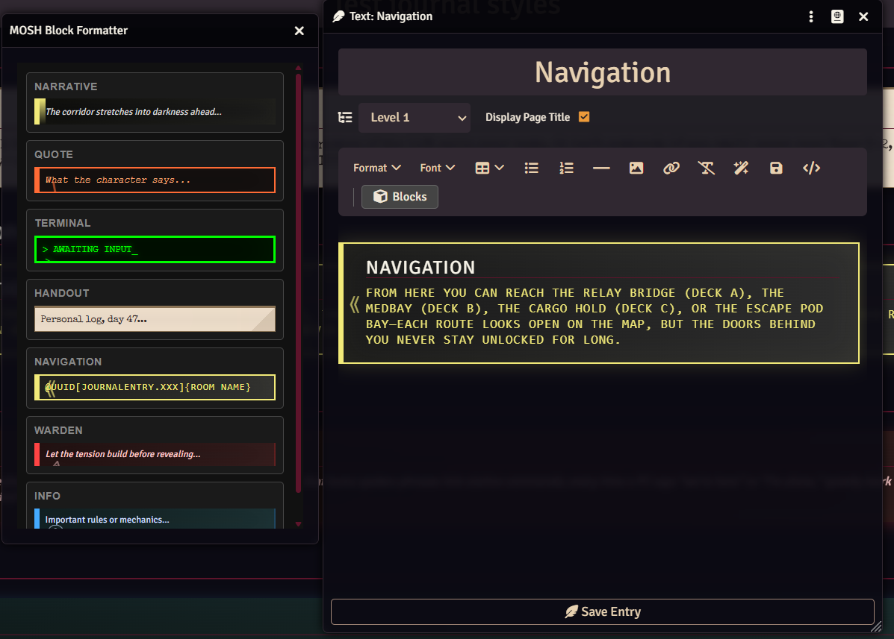

# MOSH Journal Enhancer


[English](#english) | [Русский](#russian)

---

<a name="english"></a>
## 🇬🇧 English

A comprehensive Foundry VTT module for **Mothership RPG** that enhances Journal Entries with:
- **Actor/Item Embeds** - Interactive statblocks and bio cards
- **Custom Blocks** - Narrative boxes, warnings, terminal output, and more
- **Light/Dark Theme Support** - Automatic adaptation to journal theme

---

## Screenshots

### Actor Embeds


*Creature statblock with high-contrast terminal styling*


*Character bio card with portrait and biography*


*Ship vitals display*


*Item embed card*

### How Embeds Work


*Using @Embed syntax to insert actor cards*

### Custom Blocks


*Various block types in action*


*More block examples*

### How Blocks Work


*Block selection panel in the journal editor*

---

## Features

### Actor Embeds
* **Smart Embeds**: Automatically detects Actor type:
  * **Creatures** → Statblock view (high-contrast terminal style)
  * **Characters** → Bio card view (portrait + biography)
  * **Ships** → Ship vitals view
* **Interactive**: Click to open full Actor sheet

### Custom Blocks
Insert styled content blocks in your journals:
* **Narrative** - Atmospheric read-aloud text for players
* **Quote** - NPC dialogue or radio transmissions
* **Terminal** - Ship computer/system output
* **Handout** - Notes, documents, data logs
* **Navigation** - Links to connected locations
* **Warden** - GM tips and advice
* **Info** - Important rules and information

---

## Usage

### Actor Embeds
```html
@Embed[Actor.UUID]           <!-- Smart default -->
@Embed[Actor.UUID statblock] <!-- Force statblock -->
@Embed[Actor.UUID bio=true]  <!-- Force bio card -->
```

### Custom Blocks
Use the **Blocks** button in the journal editor toolbar:

1. Select text in the editor
2. Click the "Blocks" button
3. Choose a block type
4. Done!

Or paste HTML directly:
```html
<div class="narrative-box">
  <p>The corridor stretches into darkness...</p>
</div>
```

---

## Installation

### Via Foundry VTT
1. In Foundry VTT, go to **Add-on Modules**
2. Click **Install Module**
3. Paste Manifest URL:
   ```
   https://github.com/Kikimor-rec/mosh-journal-enhancer/releases/latest/download/module.json
   ```
4. Click **Install**

### Manual Installation
1. Download the latest release from [Releases](https://github.com/Kikimor-rec/mosh-journal-enhancer/releases)
2. Extract to `Data/modules/mosh-journal-enhancer`
3. Restart Foundry VTT
4. Enable the module in your World's settings

---

## Compatibility

| Component | Version |
|-----------|---------|
| Foundry VTT | v13+ |
| [Mothership RPG System](https://github.com/Futil/foundry-mothership) | 0.6.0+ |

---

## Block Types Reference

| Block | Class | Description |
|-------|-------|-------------|
| Narrative | `narrative-box` | Atmospheric read-aloud text |
| Quote | `mosh-quote` | NPC dialogue, radio transmissions |
| Terminal | `terminal-block` | Computer/AI output |
| Handout | `handout-block` | Documents, notes, data logs |
| Navigation | `navigation-block` | Location links and exits |
| Warden | `warden-block` | GM tips and advice |
| Info | `info-block` | Rules and important info |

---

## License

MIT License - See [LICENSE](LICENSE) for details.

---

## Credits

**Author**: kikimor_rec  
**Discord**: kikimor_rec

---

<a name="russian"></a>
## 🇷🇺 Русский

Комплексный модуль для **Mothership RPG** в Foundry VTT, улучшающий Журналы:
- **Встраиваемые карточки** - Интерактивные статблоки и био-карточки
- **Пользовательские блоки** - Нарратив, терминал, предупреждения и другое
- **Поддержка тем** - Автоматическая адаптация к светлой/тёмной теме

---

## Скриншоты

### Вставки Актёров


*Статблок существа в контрастном терминальном стиле*


*Био-карточка с портретом и биографией*


*Отображение характеристик корабля*


*Встроенная карточка предмета*

### Как работают вставки


*Использование синтаксиса @Embed для вставки карточек*

### Пользовательские Блоки


*Различные типы блоков в действии*


*Дополнительные примеры блоков*

### Как работают блоки


*Панель выбора блоков в редакторе журнала*

---

## Возможности

### Встраивание Актёров
* **Умное встраивание**: Автоматически определяет тип Актера:
  * **Существа** → Вид статблока (контрастный терминальный стиль)
  * **Персонажи** → Био-карточка (портрет + биография)
  * **Корабли** → Характеристики корабля
* **Интерактивность**: Клик открывает полный лист актера

### Пользовательские Блоки
Вставляйте стилизованные блоки контента в журналы:
* **Narrative** - Атмосферный текст для зачитывания игрокам
* **Quote** - Реплики NPC или радиопередачи
* **Terminal** - Вывод бортового компьютера/ИИ
* **Handout** - Записки, документы, логи
* **Navigation** - Ссылки на локации
* **Warden** - Советы для Ведущего
* **Info** - Важные правила и информация

---

## Использование

### Встраивание Актёров
```html
@Embed[Actor.UUID]           <!-- Авто-режим -->
@Embed[Actor.UUID statblock] <!-- Принудительный статблок -->
@Embed[Actor.UUID bio=true]  <!-- Принудительная био-карточка -->
```

### Пользовательские Блоки
Используйте кнопку **Блоки** в панели редактора журнала:

1. Выделите текст в редакторе
2. Нажмите кнопку "Блоки"
3. Выберите тип блока
4. Готово!

Или вставьте HTML напрямую:
```html
<div class="narrative-box">
  <p>Коридор уходит во тьму...</p>
</div>
```

---

## Установка

### Через Foundry VTT
1. В Foundry VTT перейдите во вкладку **Add-on Modules**
2. Нажмите **Install Module**
3. Вставьте Manifest URL:
   ```
   https://github.com/Kikimor-rec/mosh-journal-enhancer/releases/latest/download/module.json
   ```
4. Нажмите **Install**

### Ручная установка
1. Скачайте последний релиз из [Releases](https://github.com/Kikimor-rec/mosh-journal-enhancer/releases)
2. Распакуйте в `Data/modules/mosh-journal-enhancer`
3. Перезапустите Foundry VTT
4. Включите модуль в настройках мира

---

## Совместимость

| Компонент | Версия |
|-----------|--------|
| Foundry VTT | v13+ |
| [Mothership RPG System](https://github.com/Futil/foundry-mothership) | 0.6.0+ |

---

## Настройки

| Настройка | Описание | По умолчанию |
|-----------|----------|--------------|
| Панель инструментов | Добавить кнопки MOSH в редактор | ✓ Включено |
| Кастомные вставки | Заменить отображение вставок актёров | ✓ Включено |

---

## Справочник по Блокам

| Блок | Класс | Описание |
|------|-------|----------|
| Нарратив | `narrative-box` | Атмосферный текст для игроков |
| Цитата | `mosh-quote` | Реплики NPC, радиопередачи |
| Терминал | `terminal-block` | Вывод компьютера/ИИ |
| Записка | `handout-block` | Документы, заметки, логи |
| Навигация | `navigation-block` | Ссылки на локации |
| Ведущему | `warden-block` | Советы для GM |
| Информация | `info-block` | Правила и важная информация |

---

## Лицензия

MIT License - См. [LICENSE](LICENSE)

---

## Авторы

**Автор**: kikimor_rec  
**Discord**: kikimor_rec
