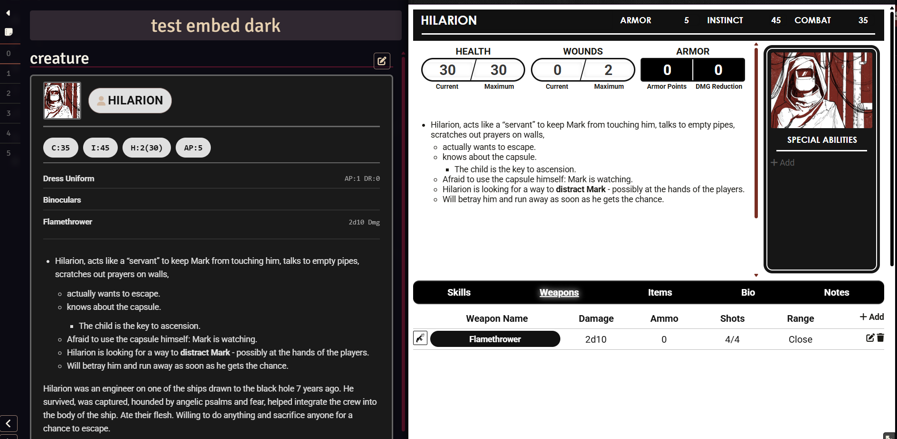
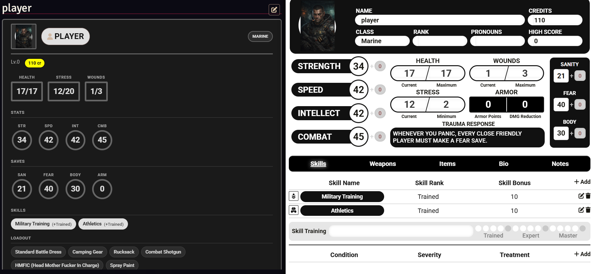
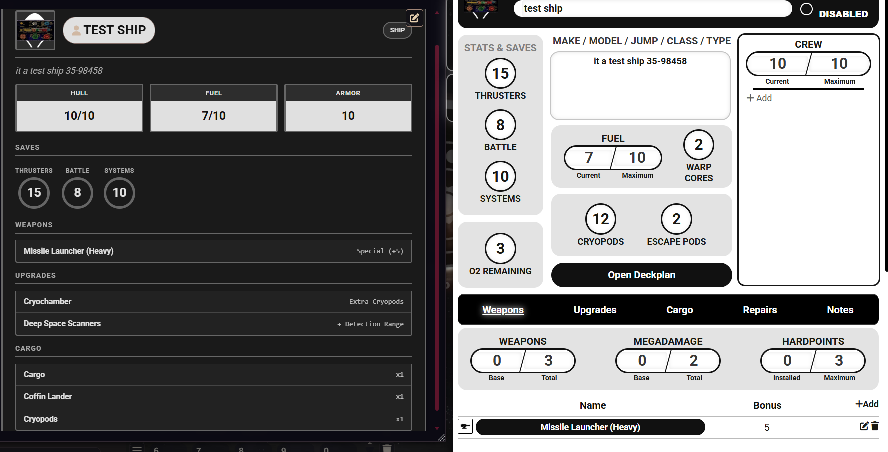
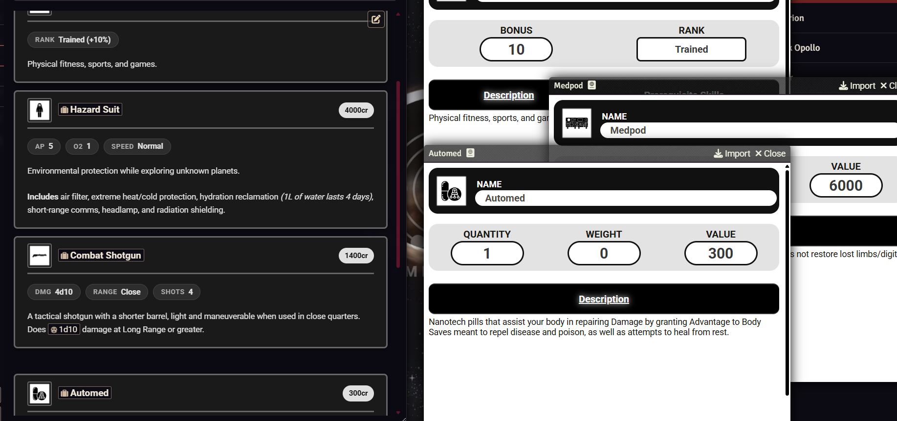
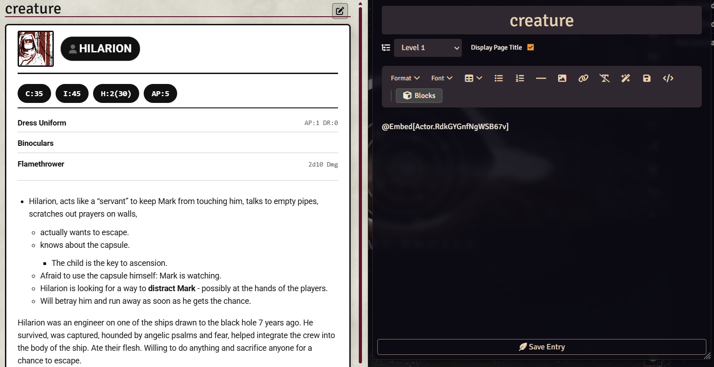
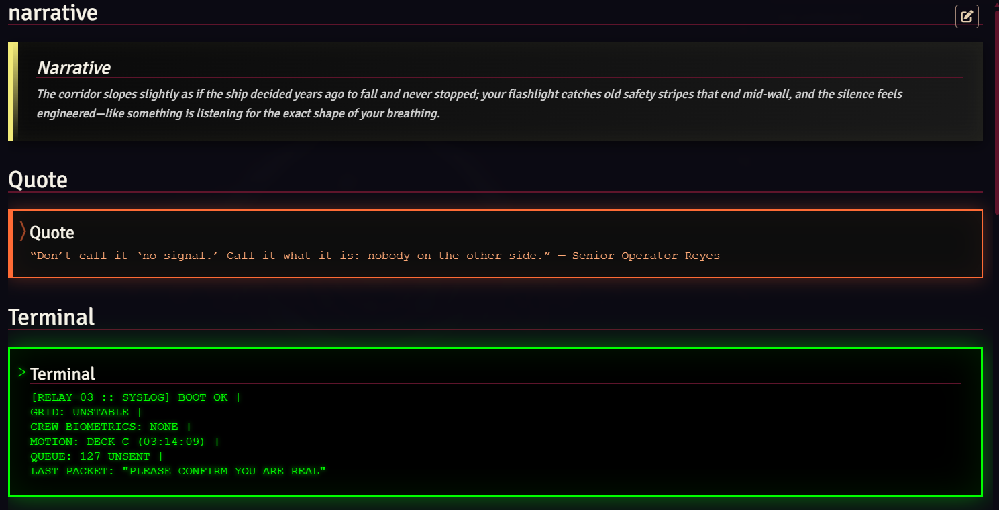
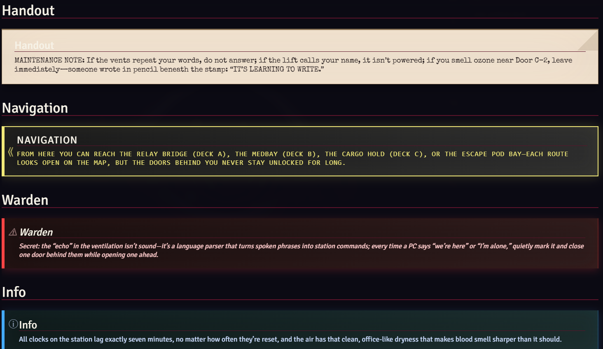
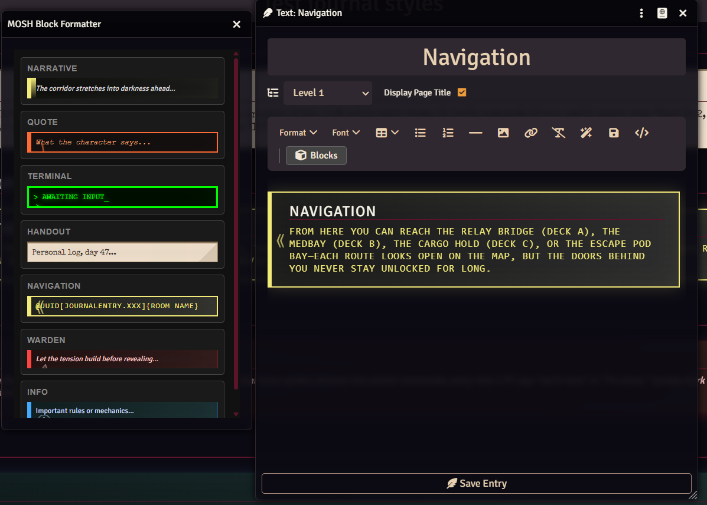

# MOSH Journal Enhancer


[English](#english) | [Русский](#russian)

---

<a name="english"></a>
## 🇬🇧 English

A comprehensive Foundry VTT module for **Mothership RPG** that enhances Journal Entries with:
- **Actor/Item Embeds** - Interactive statblocks and bio cards
- **Custom Blocks** - Narrative boxes, warnings, terminal output, and more
- **Native Editor Tools** - MOSH Blocks, Effects, Color, and Image controls in the ProseMirror toolbar
- **Figure Tools** - Insert images, captions, float layout, size presets, and visual styles
- **Light/Dark Theme Support** - Automatic adaptation to journal theme

---

## Screenshots

### Actor Embeds


*Creature statblock with high-contrast terminal styling*


*Character bio card with portrait and biography*


*Ship vitals display*


*Item embed card*

### How Embeds Work


*Using @Embed syntax to insert actor cards*

### Custom Blocks


*Various block types in action*


*More block examples*

### How Blocks Work


*Block selection panel in the journal editor*

---

## Features

### Actor Embeds
* **Smart Embeds**: Automatically detects Actor type:
  * **Creatures** → Statblock view (high-contrast terminal style)
  * **Characters** → Bio card view (portrait + biography)
  * **Ships** → Ship vitals view
* **Interactive**: Click to open full Actor sheet
* **Item Cards**: `@Embed[Item.UUID]` renders a compact MOSH item card with enriched description.
* **View Flags**: `statblock`, `bio=true`, `ship`, `view=...`, and `mode=...` can override the automatic actor view.

### Custom Blocks
Insert styled content blocks in your journals:
* **Narrative** - Atmospheric read-aloud text for players
* **Quote** - NPC dialogue or radio transmissions
* **Terminal** - Ship computer/system output
* **Handout** - Notes, documents, data logs
* **Navigation** - Links to connected locations
* **Warden** - GM tips and advice
* **Info** - Important rules and information

### Figure Tools
* **Insert Figure**: Use the Image button in the journal editor toolbar to choose an image, caption, position, size, and style.
* **Inline Toolbar**: Click an inserted MOSH figure while editing to change position, size, style, or delete the figure.
* **Layout Contract**: Figures use `float-left` / `float-right`, `size-small` / `size-medium` / `size-large`, and `style-polaroid` / `style-screen` classes.
* **Soft Compatibility**: Works with the default Foundry journal editor and adapts to Monk's Enhanced Journal when that module is active.

---

## Usage

### Actor Embeds
```html
@Embed[Actor.UUID]           <!-- Smart default -->
@Embed[Actor.UUID statblock] <!-- Force statblock -->
@Embed[Actor.UUID bio=true]  <!-- Force bio card -->
@Embed[Actor.UUID ship]      <!-- Force ship card -->
@Embed[Item.UUID]            <!-- MOSH item card -->
```

### Custom Blocks
Use the **Blocks** button in the native journal editor toolbar:

1. Select text in the editor
2. Click the "Blocks" button
3. Choose a block type
4. Done!

Or paste HTML directly:
```html
<div class="narrative-box">
  <p>The corridor stretches into darkness...</p>
</div>
```

### Text Effects
Use the **Effects** button in the native journal editor toolbar to apply inline effects to selected text. Effects and colors use ProseMirror-compatible inline markup as the primary path, with legacy DOM fallbacks only for compatibility. `Data Corruption` stays readable and marked while editing, then renders animated scrambled characters in journal view mode. Its runtime frame uses a separate visual layer, so text length stays tied to the original source and module colors can wrap the whole effect.

Use the **Color** button to tint selected text with a compact palette derived from the current sheet/theme colors.
When applying `Redacted`, the Effects dialog also offers a mask color palette so the hidden text remains visible against dark or light journal backgrounds.

### Image/Figure Workflow
1. Open a journal page in edit mode.
2. Click the **Image** button added by MOSH Journal Enhancer.
3. Select an image with the Foundry file picker.
4. Choose position, size, style, and optional caption.
5. Click the inserted image later to open the inline figure toolbar.
6. Use the toolbar to switch left/inline/right layout, small/medium/large size, default/polaroid/screen style, or delete the figure.

---

## Installation

### Via Foundry VTT
1. In Foundry VTT, go to **Add-on Modules**
2. Click **Install Module**
3. Paste Manifest URL:
   ```
   https://github.com/Kikimor-rec/mosh-journal-enhancer/releases/latest/download/module.json
   ```
4. Click **Install**

### Manual Installation
1. Download the latest release from [Releases](https://github.com/Kikimor-rec/mosh-journal-enhancer/releases)
2. Extract to `Data/modules/mosh-journal-enhancer`
3. Restart Foundry VTT
4. Enable the module in your World's settings

---

## Compatibility

| Component | Version |
|-----------|---------|
| Foundry VTT | v13-v14 |
| [Mothership RPG System](https://github.com/Futil/foundry-mothership) | 0.6.0-0.6.1 |

Monk's Enhanced Journal is optional. The module does not depend on it or recommend it in the manifest, but it will detect it when active and adapt toolbar placement for Monk's journal editors.

---

## Settings

| Setting | Scope | Default | Description |
|---------|-------|---------|-------------|
| Enable Editor Toolbar | Client | On | Adds MOSH Blocks, Effects, Color, and Image buttons to journal editor toolbars |
| Enable Custom Embeds | World | On | Replaces actor/item embed rendering with MOSH cards |
| Enable Debug Logging | Client | Off | Writes toolbar/embed diagnostics to the browser console |

---

## Block Types Reference

| Block | Class | Description |
|-------|-------|-------------|
| Narrative | `narrative-box` | Atmospheric read-aloud text |
| Quote | `mosh-quote` | NPC dialogue, radio transmissions |
| Terminal | `terminal-block` | Computer/AI output |
| Handout | `handout-block` | Documents, notes, data logs |
| Navigation | `navigation-block` | Location links and exits |
| Warden | `warden-block` | GM tips and advice |
| Info | `info-block` | Rules and important info |

### Figure Classes Reference

| Option | Classes |
|--------|---------|
| Position | `float-left`, `float-right`, or no float class for inline |
| Size | `size-small`, `size-medium`, `size-large` |
| Style | `style-polaroid`, `style-screen`, or no style class for default |

---

## Troubleshooting

* Make sure the journal page is in edit mode; figure toolbar actions only work inside an editable ProseMirror journal editor.
* If the MOSH toolbar is missing, confirm **Enable Editor Toolbar** is enabled in module settings and reopen the journal page.
* If a figure toolbar button appears to do nothing, enable **Debug Logging** and check the browser console for `Figure toolbar action` messages.
* If installing from a manifest, prefer `https://github.com/Kikimor-rec/mosh-journal-enhancer/releases/latest/download/module.json`.
* If Monk's Enhanced Journal is active, test once in a default Foundry journal page as well to isolate module compatibility issues.

---

## License

MIT License - See [LICENSE](LICENSE) for details.

---

## Credits

**Author**: kikimor_rec  
**Discord**: kikimor_rec

---

<a name="russian"></a>
## 🇷🇺 Русский

Комплексный модуль для **Mothership RPG** в Foundry VTT, улучшающий Журналы:
- **Встраиваемые карточки** - Интерактивные статблоки и био-карточки
- **Пользовательские блоки** - Нарратив, терминал, предупреждения и другое
- **Нативные инструменты редактора** - MOSH Blocks, Effects, Color и Image в панели ProseMirror
- **Инструменты изображений** - Вставка картинок, подписи, обтекание, размеры и визуальные стили
- **Поддержка тем** - Автоматическая адаптация к светлой/тёмной теме

---

## Скриншоты

### Вставки Актёров


*Статблок существа в контрастном терминальном стиле*


*Био-карточка с портретом и биографией*


*Отображение характеристик корабля*


*Встроенная карточка предмета*

### Как работают вставки


*Использование синтаксиса @Embed для вставки карточек*

### Пользовательские Блоки


*Различные типы блоков в действии*


*Дополнительные примеры блоков*

### Как работают блоки


*Панель выбора блоков в редакторе журнала*

---

## Возможности

### Встраивание Актёров
* **Умное встраивание**: Автоматически определяет тип Актера:
  * **Существа** → Вид статблока (контрастный терминальный стиль)
  * **Персонажи** → Био-карточка (портрет + биография)
  * **Корабли** → Характеристики корабля
* **Интерактивность**: Клик открывает полный лист актера
* **Карточки предметов**: `@Embed[Item.UUID]` отображает компактную карточку предмета MOSH с обработанным описанием.
* **Флаги вида**: `statblock`, `bio=true`, `ship`, `view=...` и `mode=...` могут переопределить автоматический выбор вида.

### Пользовательские Блоки
Вставляйте стилизованные блоки контента в журналы:
* **Narrative** - Атмосферный текст для зачитывания игрокам
* **Quote** - Реплики NPC или радиопередачи
* **Terminal** - Вывод бортового компьютера/ИИ
* **Handout** - Записки, документы, логи
* **Navigation** - Ссылки на локации
* **Warden** - Советы для Ведущего
* **Info** - Важные правила и информация

### Инструменты изображений
* **Вставка Figure**: Кнопка Image в панели редактора позволяет выбрать картинку, подпись, позицию, размер и стиль.
* **Встроенное меню**: Клик по вставленной MOSH-картинке в режиме редактирования открывает меню позиции, размера, стиля и удаления.
* **Контракт классов**: Используются классы `float-left` / `float-right`, `size-small` / `size-medium` / `size-large`, `style-polaroid` / `style-screen`.
* **Мягкая совместимость**: Работает со стандартным редактором Foundry и адаптируется под Monk's Enhanced Journal, если он активен.

---

## Использование

### Встраивание Актёров
```html
@Embed[Actor.UUID]           <!-- Авто-режим -->
@Embed[Actor.UUID statblock] <!-- Принудительный статблок -->
@Embed[Actor.UUID bio=true]  <!-- Принудительная био-карточка -->
@Embed[Actor.UUID ship]      <!-- Принудительная карточка корабля -->
@Embed[Item.UUID]            <!-- Карточка предмета MOSH -->
```

### Пользовательские Блоки
Используйте кнопку **Блоки** в нативной панели редактора журнала:

1. Выделите текст в редакторе
2. Нажмите кнопку "Блоки"
3. Выберите тип блока
4. Готово!

Или вставьте HTML напрямую:
```html
<div class="narrative-box">
  <p>Коридор уходит во тьму...</p>
</div>
```

### Текстовые эффекты
Используйте кнопку **Effects** в нативной панели редактора журнала, чтобы применить inline-эффекты к выделенному тексту. Эффекты и цвета используют совместимую с ProseMirror inline-разметку как основной путь, а старые DOM fallback-механизмы остаются только для совместимости. `Повреждение данных` остается читаемым и помеченным в редакторе, а в режиме просмотра журнала превращается в анимированные случайные символы. Визуальный слой отделен от исходного текста, поэтому длина соответствует оригиналу, а цвет модуля можно применить ко всему эффекту.

Используйте кнопку **Color**, чтобы изменить цвет выделенного текста через компактную палитру, собранную из цветов текущего листа/темы.
Для `Засекречено` в окне Effects также доступен выбор цвета заглушки, чтобы скрытый текст был заметен на темном или светлом фоне журнала.

### Работа с изображениями
1. Откройте страницу журнала в режиме редактирования.
2. Нажмите кнопку **Image**, добавленную MOSH Journal Enhancer.
3. Выберите картинку через файловый менеджер Foundry.
4. Настройте позицию, размер, стиль и необязательную подпись.
5. Позже кликните по вставленной картинке, чтобы открыть встроенное меню.
6. Используйте меню для переключения left/inline/right, small/medium/large, default/polaroid/screen или удаления картинки.

---

## Установка

### Через Foundry VTT
1. В Foundry VTT перейдите во вкладку **Add-on Modules**
2. Нажмите **Install Module**
3. Вставьте Manifest URL:
   ```
   https://github.com/Kikimor-rec/mosh-journal-enhancer/releases/latest/download/module.json
   ```
4. Нажмите **Install**

### Ручная установка
1. Скачайте последний релиз из [Releases](https://github.com/Kikimor-rec/mosh-journal-enhancer/releases)
2. Распакуйте в `Data/modules/mosh-journal-enhancer`
3. Перезапустите Foundry VTT
4. Включите модуль в настройках мира

---

## Совместимость

| Компонент | Версия |
|-----------|--------|
| Foundry VTT | v13-v14 |
| [Mothership RPG System](https://github.com/Futil/foundry-mothership) | 0.6.0-0.6.1 |

Monk's Enhanced Journal не является зависимостью. Модуль не требует и не рекомендует его в manifest, но обнаруживает активный Monk's Enhanced Journal и адаптирует расположение кнопок в его редакторах.

---

## Настройки

| Настройка | Описание | По умолчанию |
|-----------|----------|--------------|
| Панель инструментов | Добавить кнопки Blocks, Effects, Color и Image в редактор | ✓ Включено |
| Кастомные вставки | Заменить отображение вставок актёров | ✓ Включено |
| Debug Logging | Писать диагностические сообщения в консоль браузера | Выключено |

---

## Справочник по Блокам

| Блок | Класс | Описание |
|------|-------|----------|
| Нарратив | `narrative-box` | Атмосферный текст для игроков |
| Цитата | `mosh-quote` | Реплики NPC, радиопередачи |
| Терминал | `terminal-block` | Вывод компьютера/ИИ |
| Записка | `handout-block` | Документы, заметки, логи |
| Навигация | `navigation-block` | Ссылки на локации |
| Ведущему | `warden-block` | Советы для GM |
| Информация | `info-block` | Правила и важная информация |

### Справочник классов изображений

| Опция | Классы |
|-------|--------|
| Позиция | `float-left`, `float-right` или без float-класса для inline |
| Размер | `size-small`, `size-medium`, `size-large` |
| Стиль | `style-polaroid`, `style-screen` или без style-класса для обычного вида |

---

## Диагностика

* Убедитесь, что страница журнала открыта в режиме редактирования; меню изображения работает только внутри editable ProseMirror-редактора.
* Если кнопки MOSH не появились, проверьте настройку **Enable Editor Toolbar** и переоткройте журнал.
* Если кнопка меню изображения не даёт эффекта, включите **Debug Logging** и проверьте консоль браузера на сообщения `Figure toolbar action`.
* Для установки через manifest используйте `https://github.com/Kikimor-rec/mosh-journal-enhancer/releases/latest/download/module.json`.
* Если активен Monk's Enhanced Journal, проверьте тот же сценарий в обычном журнале Foundry, чтобы отделить проблему совместимости.

---

## Лицензия

MIT License - См. [LICENSE](LICENSE)

---

## Авторы

**Автор**: kikimor_rec  
**Discord**: kikimor_rec
